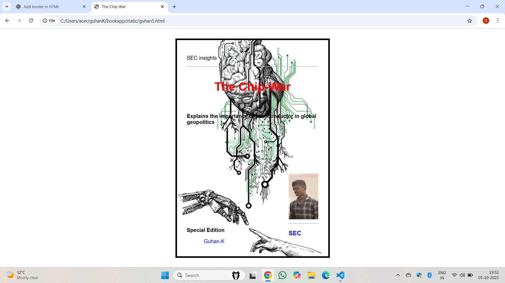

# Ex.06 Book Front Cover Page Design
## Date:05-10-2025

## AIM:
To design a book front cover page using HTML and CSS.

## DESIGN STEPS:

### Step 1:
Create a Django Admin project.

### Step 2:
Create an app in the Django interface.

### Step 3:
Create a folder named 'static' in the app folder.

### Step 4:
Create a new HTML file in the static folder.

### Step 5:
Write the HTML code with relevant CSS properties.

### Step 6:
Choose the appropriate style and color scheme.

### Step 7:
Insert the images in their appropriate places.

### Step 8:
Publish the website in the LocalHost.

## PROGRAM:
```
<!DOCTYPE html>
<html>
<head>
  
  <title>The Chip-War</title>
  <link rel="stylesheet" href="guhan5.css">
</head>
<body>
    
  <div class="book-cover">
    <p>SEC insights</p>
    <hr>
    <h1 class="title">The Chip-War</h1>
    <h2 class="subtitle">Explains the importance of semiconductor in global geopolitics</h2>

    <div class="author-section">
      
     <hr>
      <h3>SEC</h3>

    </div>

    <div class="bottom-text">
      <p class="edition">Special Edition</p>
      <p class="author-name">Guhan.K</p>
       
    </div>
  </div>
  <div>
  </div>
</body>
</html>


body 
{
 
  margin: 0;
  padding: 0;
  font-family: Arial, sans-serif;
  display: flex;
  justify-content: center;
  align-items: center;
  height: 100vh;
  background-color: white;
}

.book-cover 
{
    border: 5px solid black; 
margin: 50px;
padding: 20px;
  width: 400px;
  height: 600px;
  background-image: url("download.jpg");
  background-size: cover;
  background-position: center;
  position: relative;
  color: rgb(11, 11, 11);
  padding: 30px;
}

.title 
{
  text-align: center;
  font-size: 36px;
  margin-top: 40px;
  color:red
}

.subtitle 
{
  text-align: left;
  font-size: 16px;
  margin-top: 60px;
  color:black
}


.author-section 
{
  position: absolute;
  bottom: 40px;
  right: 30px;
  color:blue
}

.author-img 
{
  width: 90px;
  height: 140px;
}


.bottom-text 
{
  position: absolute;
  bottom: 20px;
  left: 30px;
  text-align: right;
  color:black
}

.edition 
{
  font-size: 16px;
  font-weight: bold;
 
}

.author-name 
{
  font-size: 16px;
  margin-top: 5px;
  font-style:roboto;
    color:blue
}
```

## OUTPUT:


## RESULT:
The program for designing book front cover page using HTML and CSS is completed successfully.
